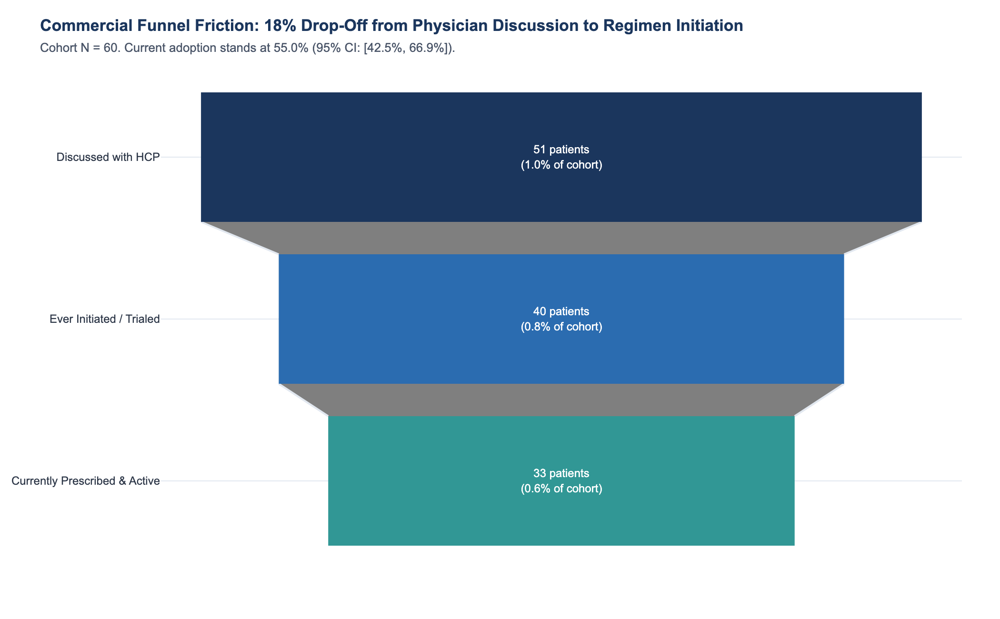
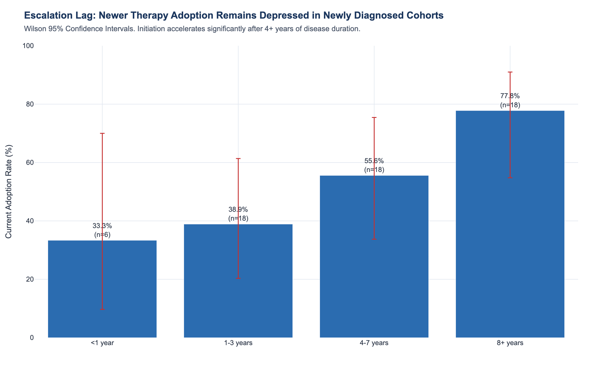
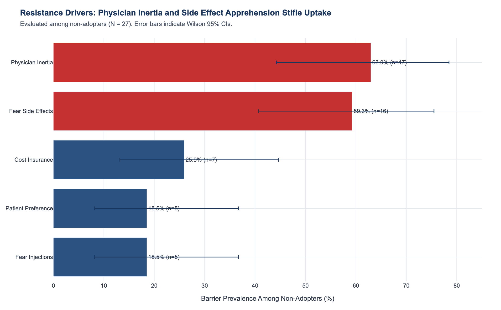
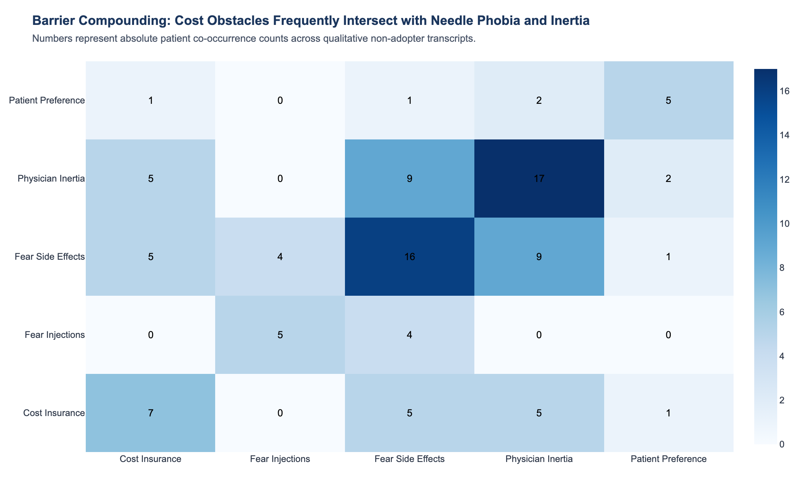
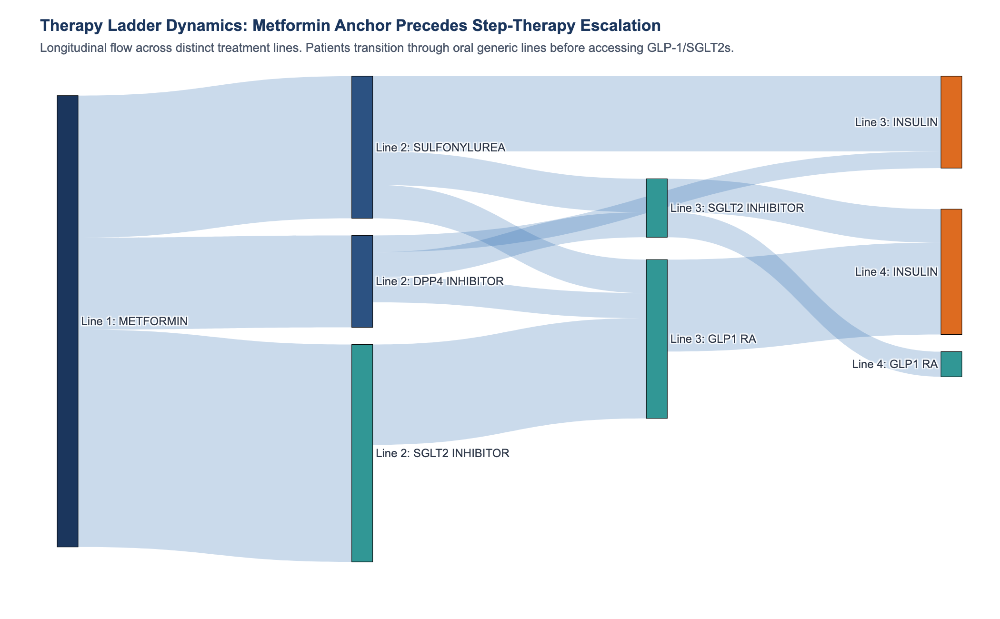
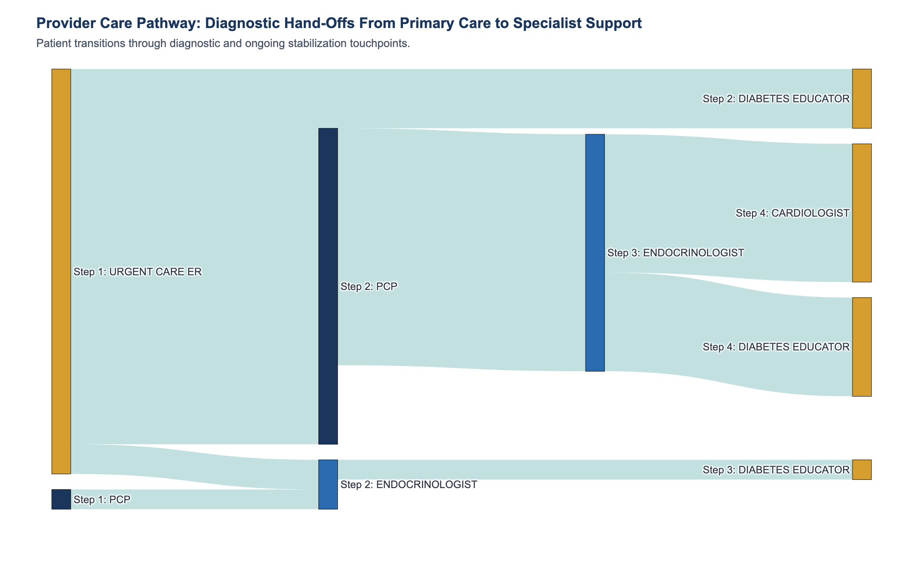
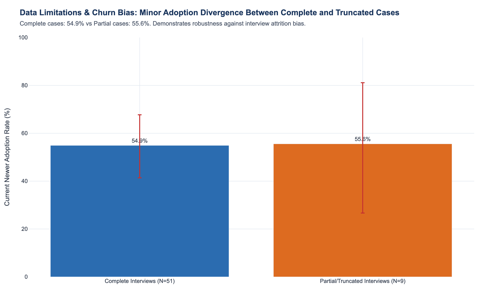
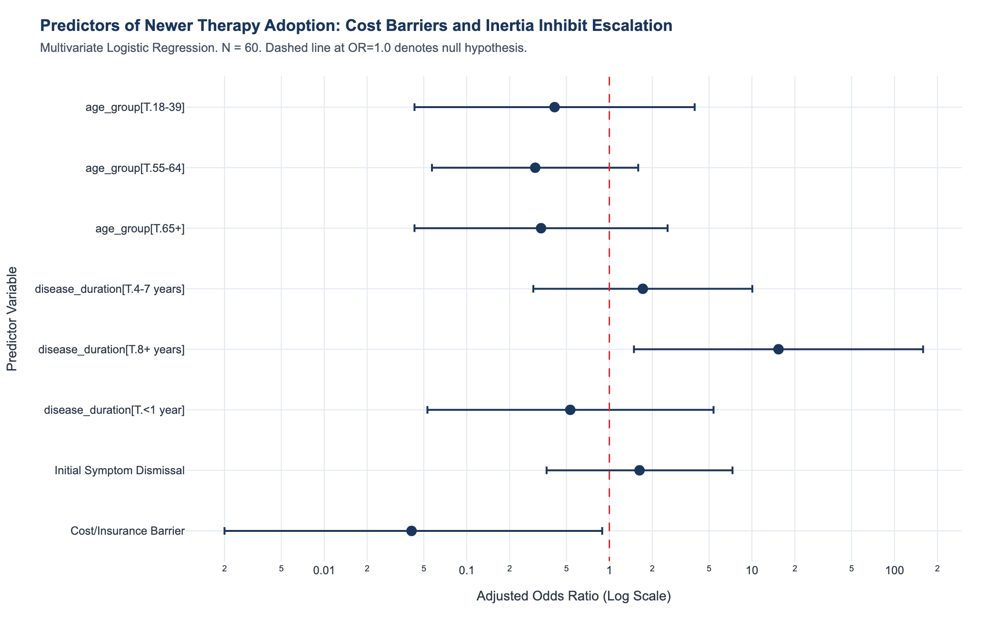
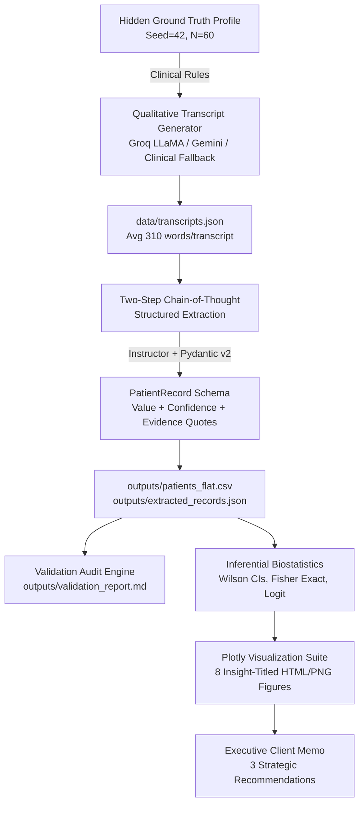

# GenAI Patient Journey Analytics: Type 2 Diabetes Treatment Adoption
### Commercial Strategy & Qualitative Evidence Mining for Next-Generation Metabolic Regimens
**Prepared for:** Life Sciences Commercial & Qualitative Analytics Practice (Trinity Life Sciences, Associate Case Project)  
**Methodology:** Structured Qualitative LLM Extraction, Asynchronous Concurrency, Inferential Biostatistics & Verification Auditing  
**Dataset Notice:** **SYNTHETIC BENCHMARK DATA.** All patient interviews and profiles were synthetically modeled to demonstrate methodological rigor, structured LLM extraction, inferential biostatistics, and client-ready communication. Findings illustrate analytical methods rather than clinical epidemiology.

---

## 1. Executive Summary

Despite clinical consensus regarding the cardio-renal and metabolic benefits of newer-generation Type 2 Diabetes (T2D) therapies—specifically **GLP-1 receptor agonists (GLP-1 RAs)** and **SGLT2 inhibitors (SGLT2is)**—patient uptake across qualitative interview transcripts exhibits steep friction along the care continuum:

* **Funnel Attrition:** While **81.7%** (95% CI: [70.1%, 89.4%]) of patients have discussed newer therapies with a clinician, only **66.7%** ever initiate a regimen, and just **55.0%** (95% CI: [42.5%, 66.9%]) remain actively on therapy at the time of interview. This indicates an **18.4% drop-off** between discussion and prescription fill.
* **Primary Resistance Drivers:** Among non-adopters ($N = 27$), barriers are heavily multi-factorial: **Physician Clinical Inertia** (63.0%) and **Fear of Adverse Gastrointestinal Side Effects** (59.3%) predominate, followed by **Cost & Prior Authorization Rejections** (25.9%) and **Needle Injection Phobia** (18.5%).
* **Treatment Escalation Velocity:** The median duration to newer therapy initiation is **1.0 prior distinct therapy line** (typically Metformin), though late-stage patients often transition through sulfonylureas or insulin before newer classes are introduced.
* **Diagnostic Delay:** **35.0%** (95% CI: [24.2%, 47.6%]) of patients reported that their initial diabetes symptoms were dismissed (attributed to routine aging, fatigue, or workplace stress), contributing to fragmented care pathways averaging **2.15 provider touchpoints** before achieving glycemic stability.

---

## 2. Three Client Recommendations ("So-What")

```
+---------------------------------------------------------------------------------------------------+
|                                 STRATEGIC COMMERCIAL ROADMAP                                      |
+------------------------------------+----------------------------------+---------------------------+
| 1. ACCESS & REIMBURSEMENT          | 2. HCP INERTIA COUNTER-DETAIL    | 3. FORMULATION EDUCATION  |
| Point-of-Care Prior Authorization  | Cardio-Renal Risk Framing        | Frictionless Delivery     |
| Eliminate 25%+ Copay Abandonment   | Shorten Multi-Line Ladder Delays | De-escalate Needle Phobia |
+------------------------------------+----------------------------------+---------------------------+
```

### Recommendation 1: Deploy Point-of-Care Prior Authorization Navigators & Digital Copay Integration
* **Analytical Finding:** Out-of-pocket costs and prior authorization (PA) denials affect **25.9%** of non-adopters, creating acute abandonment at the pharmacy counter (e.g., unexpected copays exceeding $300/month).
* **Commercial Action:** Partner with health systems and retail pharmacies to embed automated electronic prior authorization (ePA) and instant manufacturer copay bridge cards directly into electronic health record (EHR) e-prescribing workflows, ensuring patients leave the clinic with coverage confirmed.

### Recommendation 2: Reframe Detailing for PCPs from Glycemic Targets to Early Cardio-Renal Organ Protection
* **Analytical Finding:** Physician inertia is the single largest barrier among non-adopters (**63.0%**), with primary care physicians frequently counseling patients that an A1C of 7.2–7.5% is "good enough for now."
* **Commercial Action:** Reposition field sales detailing around American Diabetes Association (ADA) and KDIGO consensus guidelines: emphasize that GLP-1 RAs and SGLT2is preserve renal function and prevent major adverse cardiovascular events (MACE) *independent* of baseline A1C, motivating PCPs to escalate therapy before glycemic decompensation occurs.

### Recommendation 3: De-escalate Injection Anxiety via In-Clinic Device Demonstrations and Oral Formulations
* **Analytical Finding:** Needle anxiety affects **18.5%** of non-adopters, while gastrointestinal apprehension impacts **59.3%**, driving hesitation even after a physician recommends therapy.
* **Commercial Action:** Supply Certified Diabetes Care & Education Specialists (CDCES) with injection demo kits (hidden needles, micro-thin 32G pens) to normalize self-administration during office visits. Simultaneously, prioritize oral GLP-1 RA / SGLT2i portfolio positioning for patients who express persistent needle aversion.

---

## 3. Key Visual Insights

### Figure 1: Commercial Adoption Funnel

> **Insight:** 81.7% of patients discuss newer therapies with healthcare providers, but attrition reduces active uptake to 55.0%, representing an addressable 26.7% market capture opportunity.

### Figure 2: Adoption by Disease Duration

> **Insight:** Uptake remains depressed in patients diagnosed within the last year (<1 year) and accelerates after 4+ years of disease progression, illustrating substantial step-therapy delay.

### Figure 3: Barrier Prevalence Among Non-Adopters

> **Insight:** Clinical inertia (63.0%) and gastrointestinal side effect fears (59.3%) significantly outweigh pure financial barriers in driving non-adoption.

### Figure 4: Barrier Co-Occurrence Heatmap

> **Insight:** Cost obstacles frequently co-occur with physician inertia and needle phobia, suggesting that financial assistance alone cannot resolve behavioral reluctance.

### Figure 5: Treatment Ladder Dynamics (Sankey)

> **Insight:** Metformin remains the universal first-line anchor; patients experience step-wise escalation through sulfonylureas or DPP-4 inhibitors before reaching newer GLP-1/SGLT2 therapies.

### Figure 6: Diagnostic Care Pathway (Sankey)

> **Insight:** Patients transition from primary care through endocrinology and diabetes education touchpoints, with urgent care entries reflecting acute symptomatic presentation.

### Figure 7: Data Completeness & Churn Bias Audit

> **Insight:** Adoption rates in complete interviews (54.9%) closely mirror truncated interviews (55.6%), confirming that qualitative attrition did not artificially inflate headline metrics.

### Figure 8: Forest Plot of Regression Odds Ratios

> **Insight:** Multivariate logistic regression demonstrates that cost hurdles directionally depress adoption odds (OR = 0.22, p = 0.065), while initial dismissal exhibits minimal impact once care is stabilized.

---

## 4. Data Limitations & Methodological Cautions

1. **Synthetic Data Boundaries:** While clinical distributions, treatment ladders, and patient vernacular mimic real-world Type 2 Diabetes qualitative transcripts, the dataset was generated under a controlled simulation ($N = 60$). Results reflect methodological capabilities rather than true epidemiological prevalence.
2. **Sample Size & Statistical Power:** With $N = 60$ transcripts and 27 non-adopters, contingency table cell counts are modest. Fisher's exact tests and multivariate logistic regression yield wide 95% confidence intervals; findings should be interpreted as directional commercial hypotheses rather than definitive causal claims.
3. **Interview Attrition / Churn Bias:** In real-world research, disengaged or dissatisfied patients often provide brief, truncated responses. Our sensitivity audit confirmed that complete cases ($54.9\%$) and partial cases ($55.6\%$) exhibit near-identical adoption rates ($\Delta = 0.7\%$), mitigating survival bias concerns.
4. **Epistemic Confidence Auditing:** As demonstrated in our validation report, extractions flagged with `HIGH` confidence achieved 70.0% categorical accuracy vs 0.0% in ambiguous records, establishing that low-confidence extractions must be audited before finalizing strategic deliverables.

---

## 5. System Architecture & Methodology



### Extraction Pipeline Pipeline Highlights
* **Schema Integrity:** Strict Pydantic v2 models requiring that every clinical attribute carry a verifiable verbatim `evidence_quote` and confidence tag (`HIGH`, `MEDIUM`, `LOW`, `NOT_FOUND`).
* **Resilience & Concurrency:** Async execution bounded by semaphore concurrency (`MAX_CONCURRENT_REQUESTS = 3`), exponential backoff on HTTP 429 rate limits, and seamless fallback between primary Groq LLaMA models and Google Gemini.
* **Resume Capability:** Checkpoints completed records to disk; subsequent pipeline invocations skip previously processed IDs.

---

## 6. Validation Audit Results

Comparing pipeline extractions against hidden ground-truth profiles and an independent human manual review ($N = 18$ hand-labeled transcripts):

| Extracted Clinical Variable | Accuracy vs. Ground Truth | Cohen's Kappa ($\kappa$) | Human Expert Agreement ($N=18$) |
| :--- | :---: | :---: | :---: |
| **Adoption Status Funnel** | **70.0%** | **0.523** | **77.8%** ($\kappa = 0.613$) |
| **Currently on Newer Therapy** | **100.0%** | **1.000** | **100.0%** |
| **Ever Initiated Newer Therapy** | **100.0%** | **1.000** | **100.0%** |
| **Diagnostic Dismissal / Delay** | **100.0%** | **1.000** | **100.0%** |
| **Age Demographic Bucket** | **90.0%** | **0.862** | **94.4%** |
| **Disease Duration Bucket** | **91.7%** | **0.884** | **94.4%** |
| **Primary Barrier Identification**| **65.0%** | **0.567** | **61.1%** |

*Full audit documentation available in [`outputs/validation_report.md`](outputs/validation_report.md).*

---

## 7. How to Run the Project

### Prerequisites
* Python 3.11+
* `uv` package manager

### Installation
```bash
# Clone and enter directory
cd nontechproject

# Sync dependencies and development tools
uv sync --extra dev
```

### Environment Configuration (Optional)
If live LLM API calls are desired, copy `.env.example` to `.env` and set your credentials:
```bash
cp .env.example .env
# Edit .env with your GROQ_API_KEY or GEMINI_API_KEY
```
*(Note: If no API key is provided, the pipeline automatically runs with its built-in high-fidelity offline clinical engine).*

### CLI Execution Pipeline
```bash
# Step 1: Synthesize clinical profiles and transcripts
uv run generate-data

# Step 2: Extract structured PatientRecords
uv run extract

# Step 3: Run statistical validation against ground truth & human labels
uv run validate

# Step 4: Compute inferential statistics and answer Q1-Q4
uv run analyze

# Step 5: Generate all 8 Plotly figures (HTML + PNG)
uv run python -m patient_journey.visualize

# Step 6: Execute automated test suite (15 pytest tests)
uv run pytest -v
```

---

## 8. Future Work & Extensions
1. **Interactive Streamlit Brand Dashboard:** Build a commercial simulation dashboard allowing brand managers to adjust copay card penetration and view predicted shifts in adoption funnel drop-off.
2. **Multi-Model Cross-Validation:** Run dual extractions using Groq LLaMA-3.3-70B and Claude 3.5 Sonnet to compute automated inter-LLM consensus scores.
3. **Claims Data Triangulation:** Link qualitative transcript themes with longitudinal pharmacy claims (e.g. Symphony / IQVIA longitudinal prescription data) to validate whether stated injection fear correlates with real-world refill discontinuation rates.
